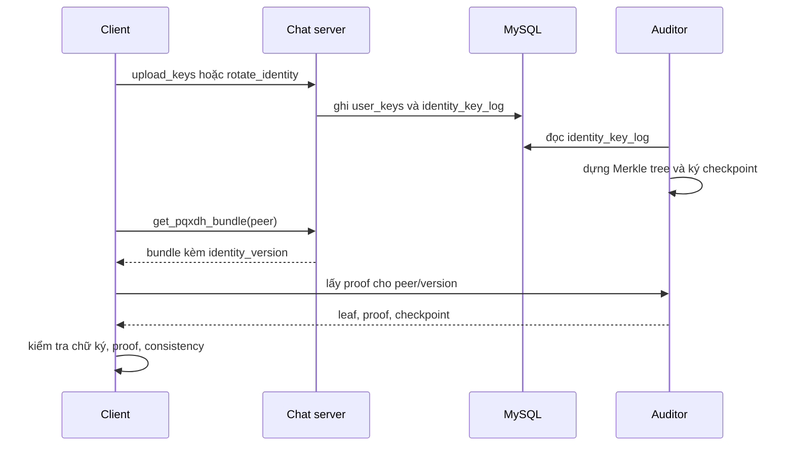

# Minh bạch khóa định danh trong SecChat

SecChat đã có identity key và safety number. Cơ chế đó giúp người dùng phát hiện
key substitution nếu họ thật sự so sánh safety number qua một kênh khác. Điểm yếu
là server vẫn có thể thử đưa key khác nhau cho những client khác nhau, đặc biệt ở
lần đầu liên lạc hoặc khi một người rotate identity.

Bản nâng cấp này thêm auditor service riêng. Chat server ghi lịch sử identity vào
bảng `identity_key_log`. Auditor đọc bảng đó, dựng Merkle tree, ký checkpoint và
trả inclusion proof cho client. Khi client nhận `pqxdh_bundle`, client kiểm tra
rằng identity key trong bundle thật sự có mặt trong log đã được auditor ký.

Luồng chính như sau:

Cơ chế này không thay thế safety number. Nó làm cho lịch sử key rõ ràng hơn và
giảm khả năng server thay key âm thầm. Người dùng vẫn cần so sánh safety number
khi muốn xác minh danh tính ở mức con người. Nếu auditor không truy cập được,
client hiển thị trạng thái audit unavailable. Nếu proof sai, checkpoint rollback
hoặc key trong bundle không khớp log, client chuyển sang audit mismatch và chặn
gửi tin nhắn cho tới khi người dùng review.

Client cũng lưu một checkpoint auditor chung cho toàn tài khoản trên thiết bị.
Điều này giúp phát hiện trường hợp server hoặc auditor cho các contact khác nhau
thấy các log head mâu thuẫn trên cùng một client. Nếu checkpoint mới nhỏ hơn
checkpoint đã thấy, hoặc cùng kích thước nhưng root khác, client coi đó là
rollback hoặc split-view. Màn hình verify hiển thị cả log head của contact và
pinned account log để người dùng có thể so sánh khi cần.

Giới hạn cần ghi rõ: auditor service trong project là một thành phần riêng nhưng
vẫn chạy trong cùng môi trường Docker demo. Nó phù hợp cho đồ án vì mô tả được
ý tưởng key transparency và có code kiểm tra thật. Nó chưa phải hạ tầng public
transparency như Certificate Transparency quy mô production, chưa có nhiều
auditor độc lập, chưa có public checkpoint bên ngoài, chưa có gossip giữa client
qua kênh không phụ thuộc server và chưa giải quyết metadata.
